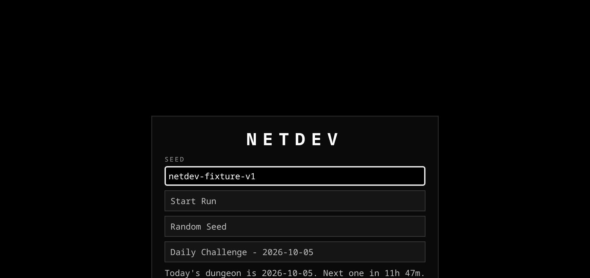
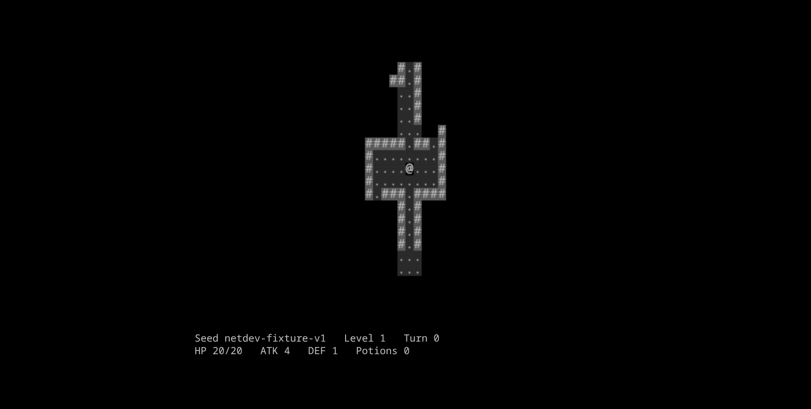
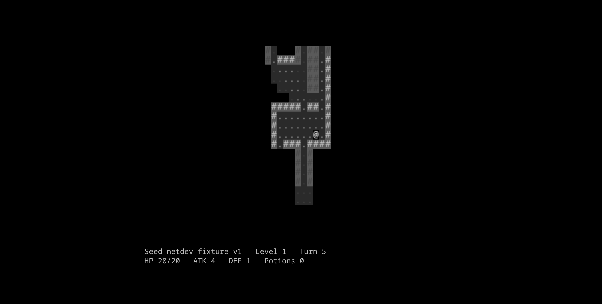
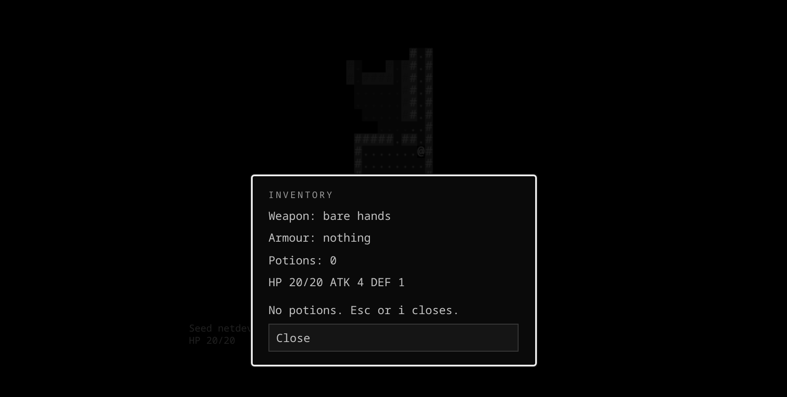
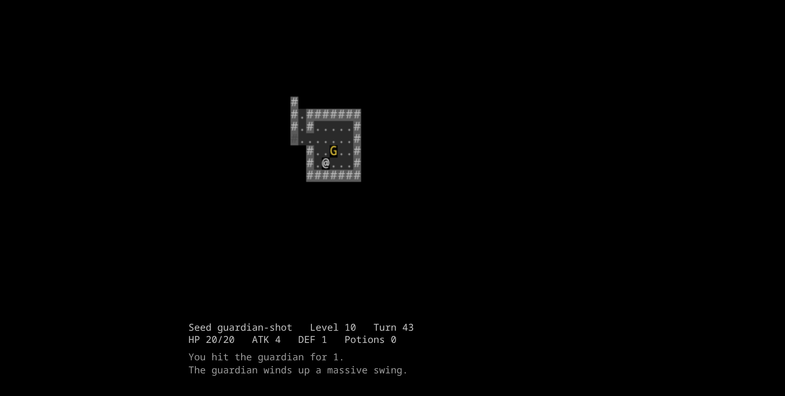

# Netdev

A turn-based ASCII roguelike where **the same seed produces the same dungeon, forever** —
including across save and resume, where the map is never stored because it is regenerated from
the seed.

That constraint is the project. Getting it to hold required splitting randomness into two streams
that never touch, hashing seeds ourselves because the map generator's library will not, and
rebuilding a dungeon from three recorded numbers instead of trusting a serialised copy of it.

Ten levels, a boss on the tenth, a shared daily dungeon, and no backend of any kind — 27 kB
gzipped, with no external request anywhere in the build.



## Quick start

Node 22 or newer.

```bash
git clone https://github.com/HihaW/netdev.git
cd netdev
npm install
npm run dev
```

Open the URL Vite prints. Type a seed, press **Start Run**, and the arrow keys or WASD walk.

```bash
npm test        # 442 tests
npm run verify  # lint, typecheck, tests, build — the definition of done
```

## The determinism contract

> Given a seed string `S` and a level number `L`, the dungeon layout, the room list, the door
> positions, the player spawn, the stairs position, every enemy spawn and every item spawn are
> **byte-identical** on every machine, every browser, forever. No wall-clock value, no
> `Math.random`, no unseeded source may influence level construction.

| Stream | Seeded from | Consumed by | In the save? |
|---|---|---|---|
| **Generation** — `ROT.RNG`, the library's global singleton | `deriveSeed(S, L, "gen")` | Level construction only: map generation, enemy placement, item placement, item tier rolls | No — reproducible by construction |
| **Gameplay** — a private `RNG` instance | `deriveSeed(S, L, "play")` | Only two things: combat damage rolls and the enemy-death drop roll | Yes, as `playRngState` |

The split exists because rot.js's map generators read the *global* `ROT.RNG` and accept no injected
instance ([rot.js#201](https://github.com/ondras/rot.js/issues/201)). So the global RNG is dedicated
to construction and gameplay never touches it. `gameplayRandom()` in `src/game/rng.ts` is the single
chokepoint, which is what makes "the global stream is construction-only" checkable with one grep.

**Why the map is not in the save file.** `deserialize` in `src/game/save.ts` calls
`regenerateLevel(seed, level, generator, attempt)` — three numbers the save does record — and runs
the acceptance checks against that exact attempt. Redundant state can only drift from its source;
regenerated state cannot. A save that no longer rebuilds is a `LevelGenerationError` rather than a
quietly different dungeon with the wrong enemies standing on it.

Both streams are re-seeded on every level entry, not once per run. A level's combat rolls are then
a function of `(seed, level)` alone, so the fight on level 5 does not depend on whether you looted
two extra potions on level 4.

### What proves it

[`test/determinism.test.ts`](test/determinism.test.ts) — the release gate:

- **250 seeds × 10 levels, generated twice, deep-equal** on tiles, rooms, spawn, stairs and every
  field of every entity. Plus the mirror: distinct seeds must produce distinct levels, or a
  generation path that stopped using the seed would pass the first test perfectly.
- **A checked-in fixture** of levels 1–10 for one seed, so a change in Digger's behaviour is caught
  even where the suite happens to pass by luck. Regenerate with `npm run fixture:determinism`.
- **Contamination**: 50 levels, 10 000 gameplay draws spent between two generations of the same
  level, which must come back identical.
- **Save round-trip**: `playRngState` survives `serialize → deserialize`, and the next 100 draws
  match those that would have followed without it. Two runs driven by the same input produce
  byte-identical saves except `savedAt`.

### One honest note about that suite

The negative test — deliberately add a `ROT.RNG` draw to `combat.ts` and confirm the suite fails —
found something the ticket had backwards. **The behavioural tests do not catch it; only the source
grep does**, and for a structural reason: `beginLevelConstruction()` reseeds the global stream at the
start of every generation, so a stray global draw spent during combat is discarded before the next
level is built. Contamination has no path to propagate.

That makes the three grep gates load-bearing rather than cosmetic:

```
grep -rn "Math.random" src/                                  # nothing
grep -rln "ROT.RNG" src/                                     # rng.ts, spawn.ts only
grep -rnE "Date.now|performance.now|new Date\(\)" src/game/   # daily.ts only
```

`src/game/daily.ts` is the single permitted wall-clock read, and it exists only to turn an instant
into a UTC date string. It never reaches a level: a daily run is an ordinary run whose seed happens
to be a date, with no `daily: true` flag anywhere in the codebase.

## Architecture

```
src/game/     the rules. no DOM, no clock, no network
  config.ts     every tunable number in the project
  rng.ts        seed hashing, the two streams, the one chokepoint
  dungeon.ts    Digger + Uniform + acceptance guard + regenerateLevel
  bfs.ts        distanceField, nextStep, per-turn memo
  fov.ts        player FOV, per-enemy senses FOV, explored bitmap
  entities.ts   factories and id allocation
  spawn.ts      stairs, enemies, items, the unlock schedule
  combat.ts     damage, attack resolution, death, drops
  turns.ts      turn order, aggro, flee, cadence, cleave, descent, victory
  save.ts       serialise, deserialise, triggers, run history
  daily.ts      dailySeed and the countdown to the UTC rollover
  types.ts      the shared shapes every module speaks in
src/data/     the stat and item tables, straight from the spec
src/ui/       canvas renderer, DOM HUD, menu screens
scripts/      fixture generation, screenshot capture — not shipped
```

Storage and the clock are injected rather than read, which is why `src/game/` has no `new Date()`
outside `daily.ts` and why the whole game layer runs under vitest's node environment.

### Three decisions a reviewer would question

**Why rot.js, and what it cost.** It is unmaintained and feature-complete, pinned at `2.2.1` on
purpose. Two things it will not do: hash a string seed (`setSeed` takes a number, and passing a
string silently produces an identical zero state every time —
[rot.js#184](https://github.com/ondras/rot.js/issues/184)), and accept an injected RNG into its map
generators. So `cyrb53` does the hashing and the global singleton is dedicated to construction.

**Why not `ROT.Path.Dijkstra`.** It exposes steps to a goal, not a distance map, and the turn loop
needs the field itself — flee logic maximises BFS distance, and the stairs placement check asks
which room is furthest. `src/game/bfs.ts` is about 30 lines and memoises per origin for the turn.

**Why the map is not saved.** Covered above: regenerated, not stored, and proved by test.

## Screens

| | |
|---|---|
|  |  |
| Level 1, turn 0. Shadowcasting limits sight to radius 8; everything else is black until walked. | A few turns in. Explored-but-not-visible tiles stay dimmed, so the shape of where you have been is legible. |
|  |  |
| The inventory. Equipment is folded into effective ATK/DEF, so this panel and the HUD cannot disagree. | Level 10. The Guardian telegraphs for a full turn before the cleave lands — the fight is decided on whether you read the log line. |

## Tuning record

[`TUNING.md`](TUNING.md) records thirty bot runs against the difficulty curve. The substantive
result is that **no number was changed**, and the file says why in as much detail: the bot never
retreats, never kites and never uses terrain, so its deaths measure the floor of the curve rather
than its middle. Two harness bugs masqueraded as difficulty findings before being caught, which is
recorded too — a measurement that has not been sanity-checked against its own harness is not
evidence.

## Known limitations

- **rot.js is unmaintained.** Pinned exactly, and its generator behaviour is what the checked-in
  fixture defends against.
- **Three enemy types**, of which two differ mainly in stats. The behaviour variety is thinner than
  the PRD asked for. The Guardian is the one enemy with a real mechanic.
- **The Guardian is a single mechanic** with no second phase.
- **Save is on level entry and explicit quit**, not per turn — quitting mid-level loses that
  level's progress. A resumed run reports the checkpoint's turn count, not the last turn played.
- **Save schema is version 1** and has never been migrated, because there is nothing to migrate
  from.
- **Progress is per-browser.** `localStorage` only, so a run does not follow you between machines,
  and it is lost if the origin changes. There is no account system and no cloud save, by design.

## Controls

Arrows or WASD to move, `q`/`e`/`z`/`c` for diagonals, `.` to wait a turn, `i` for inventory, `Esc`
to pause, `?` for the key reference.

## For contributors

Three rules:

1. **No `Math.random()` in `src/`.** Seeded randomness goes through `beginLevelConstruction()` during
   level building or `gameplayRandom()` during play. Nothing else.
2. **`ROT.RNG` appears only in `rng.ts` and `spawn.ts`.** If you are about to name the global
   singleton anywhere else, you are writing a bug — and a grep will say so.
3. **`src/game/config.ts` owns every tunable number.** A value that is not in `config.ts` is scope invention. Ask; do not pick a plausible number and move on.

